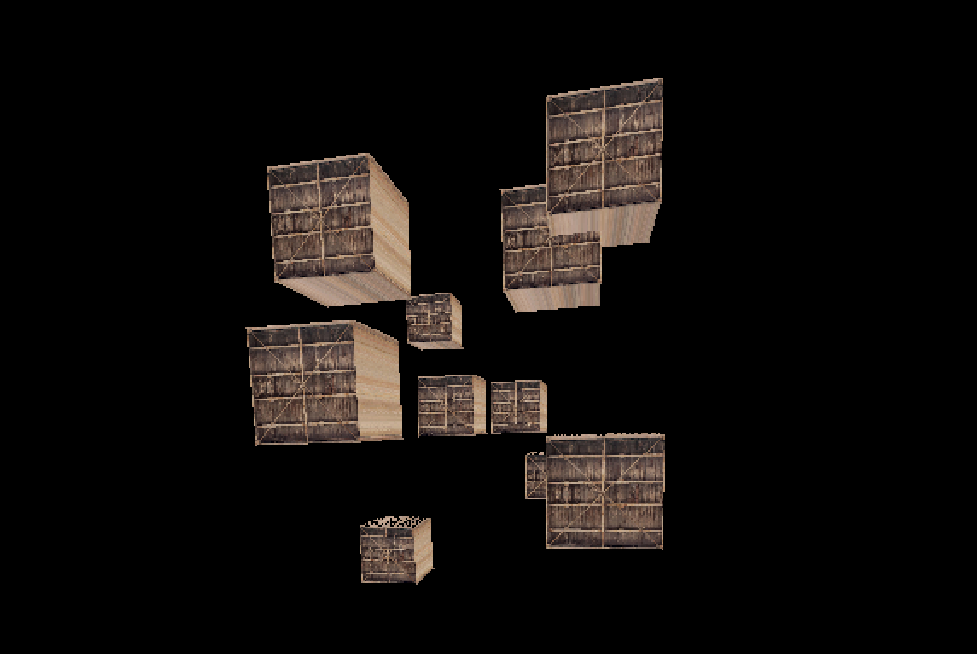

# C Real-Time Software Rasterization Engine

A small project for the sole purpose of learning the basics of computer graphics and bare bones C programming.

The project consists of three major parts:
* A basic software rendering engine.
* A small matrix operations library (smol, outsourced as seperate library).
* A simple application demo of the above.

I greatly appreciate any critique and pointers concerning programming style and performance or any mistakes I may have done.

## Features
* Triangle Rasterization
* Vertex & Index Buffers
* Texture Buffers & Interpolation
* Vertex Array Objects with Vertex Attributes
* Perspective Vertex Attribute Interpolation
* Simple (Wavefront) Mesh Loading
* Trivial Triangle Clipping
* Vertex & Fragment Shader
* Z-buffering
* Texturing

## Todo
* Better Model loading capabilities
* Performant texturing
* Polygon clipping
* Mip-Mapping
* Anisotropic filtering
* Geometry Anti-Aliasing

## Bugs
* Fix issues with Bresenheim Line Rendering, currently not used

## Libraries
#### [SDL2](https://www.libsdl.org/), 
Used for hosting display output and processing events. Follow the installation guideline for your platform.

#### [stb_images.h](https://github.com/nothings/stb/blob/master/stb_image.h)
 A single header image library used to load image data into textures. 
 File already included in the `inc` directory.

#### [SMOL](https://github.com/BeratE/smol)

## Licence
This software is published under the GNU GPLv3.
